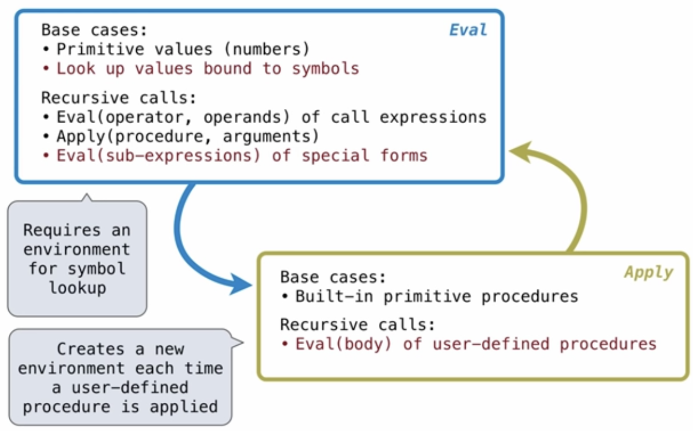
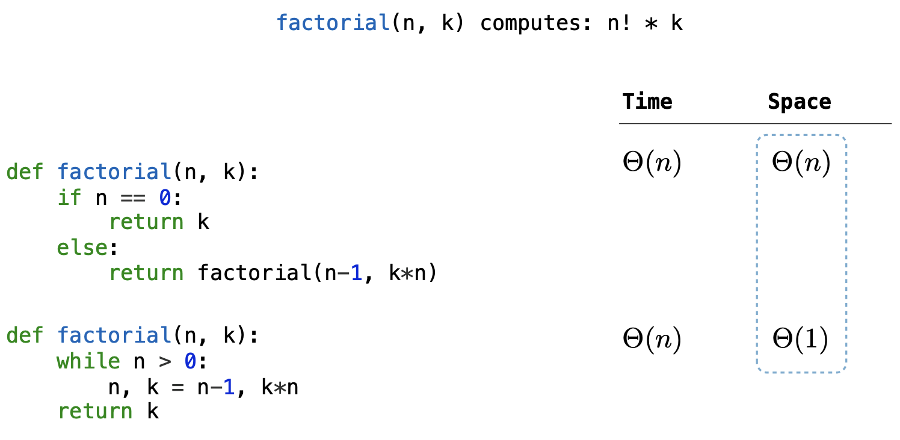

## Lecture 25 - Scheme

The most fundamental concept of programming is that of an interpreter - a program, which is just text, is only given meaning via another program, which is the interpreter.

This idea is built up using **Scheme**, which is a dialect of **Lisp** (the second oldest programming language after Fortran).

Scheme programs consist of primitives which are base values, and call expressions, which are essentially functions:

- **Primitives** and **Symbols**: `2`, `3.3`, `#t`, `+`, ...
- **Call Expressions**: `(quotient 10 2)` or `(not true)`
- **Special Forms**, discussed below

**Primitives**:
**Symbols** are like a name, but also a type of value. A symbol starts with `'` single quote.
**Booleans** are simple - all values are falsy, except true

**Call expressions** include an operator and zero or more operands in parentheses. Scheme uses **prefix notation**. Functions in Scheme are called **procedures**. Spacing is entirely optional in Scheme/Lisp.

Some common built in functions:

- `+`, `-`, `*`, `/`
- `number?` to tell if something is numeric
- `zero?` to tell if something is zero
- `integer?`

**Special Forms** are any combination that is not a call expression. Examples:

- `(if <predicate> <consquent> <alternative>)`
- `(and <e1> <e2> ...)` - defaults to `#t`
- `(or <e1> <e2>)` - defaults to `#f`
- `(not <e>)`

Things can be defined using the `define` special form:

- Defining variables: `(define <symbol> <expression>)` for example `(define pi 3.14)`
- Defining functions: `(define (<symbol> <parameters>) <body>)`

For **equality**, Scheme has three options:

1. `=` compares numbers only, throws error on other types
2. `eq?` compares identity (`is` in Python)
3. `equal?` compares values (`==` in Python), so two equivalent lists are `equal?`, but not `eq?`

Scheme does *lazy evaluation*.
All expressions in Scheme evaluate to a single value, unlike Python, where if statements control program flow. 
All functions return the value of the last expression in the body
Example of a function in Scheme:

```scheme
(define (abs x)
  (if (< x 0) (- x) x)
)
```


Scheme also heavily uses **Lambda expressions**. The following two are equivalent:

```scheme
(define (square x) (* x x))
(define square (lambda (x) (* x x)))
```


A **list or array** can be expressed in Scheme using a built in type called a **pair**. There are three concepts related to pairs:

- `cons` is a procedure that creates a pair: `(cons 1 2)`
- `car` is a procedure that returns the first element of a pair
- `cdr` is a procedure that returns the second element of a pair
- `nil`,` `'()`, or `'()' is an empty list

A **dotted list** is a broken list, and it is one that doesn't have follow the linked list recursive definition (i.e. the second item in the pair is **not** `nil` or another pair).

Scheme interpreter displays the lists in the following fashion:

- For a dotted list which is a non-linked-list, e.g. `(cons 1 10)`, it displays `(1 . 10)`
- For a linked list/array (e.g. `(cons 1 (cons 10 nil))`), it displays `(1 10)`

Helpful methods related to lists:

- `pair?` determines if something is a pair
- `null?` determines if something is `nil`
- `list` which makes a list from parameters: `(list 1 2 3 4 5)`
- **quote form** which can build a list: `'(1 2 3 4 5)`
- `append`, which concatenates two lists

**Dot Rule** - When there is a dot immediately followed by a open parenthesis, the dot and the set of parentheses are omitted.

```scheme
scm> (1 2 (3 . (4 . 5)))
(1 2 (3 4 . 5))
```


**Symbolic Programming**

The **single quotation mark** allows directly evaluating symbols, and is used for **metaprogramming** and some elements of the `eval` method. **Single quotation** allows symbols to be directly used as values. Some examples for where this can be used:

1. Symbols typically stand for values but quotation allows constructing lists out of symbols
2. List output can be evaluated in to the underlying lists

Any expression that is not evaluated is said to be **quoted**. Quotes stop an expression from being evaluated, and instead use it as a symbol/list.

```scheme
> (list 'a 'b)
(a b) 		; note that a and b don't need be defined

> (car '(a b c))
a	  ; interpreted as a list

> '(1 2 . 3)
(1 2 . 3)

> '(1 2 . (3 4))
(1 2 3 4) 	; this makes sense - a dot with a pair is actually not malformed
```

You can refer even to symbols that have not been defined yet!


**Sierpinski's Triangle** - implemented in Scheme in lecture 25s


**Tail Recursion**

- Tail recursion makes the recursive function close the frame rather than adding to the call stack. If no more work left, then we can call self again without waiting for results
- Function is **tail recursive** if every recursive call is a tail call
- This can be done by passing the result to the next call, rather than waiting for the result and appending to work done in a single call

How to Tail Call Optimize:

- Create a helper method that does most of the work, and takes another argument for `result` so far
- Call the helper from the outer function with base result (e.g. 0 as result)
- Things that are changing from one iteration to the next (i.e. the result) should be parameters in the helper (tail-call-optimized) function
- The base case should return the final answer which is the new `result` parameter, not `nil`/0/etc.


## Lecture 27 - Calculator (Scheme Interpreter)

**Interpreters** read input program from text (string), and parse it to interpret it as a hierarchical structure of the expressions it represents. For example, in Scheme, this is realtively easy because of the matched parentheses:

```scheme
(<element_0> <element_1> ... <element_n>)
```

There are two types of programming languages:

1. **Machine Languages**: statements *interpreted by the hardware*, as they represent operations on the CPU directly. Memory operations directly target hardware also - no abstraction mechanisms.
2. **High-level Languages**: statements are interpreted by another program and **compiled** into another language that the CPU understands.


**Metalinguistic Abstraction**:

A language is created to abstract functionality so that a problem domain is simplified, or to suit a particular type of application. For example:

- **Type of Application**: Erlang is good for concurrency, and is good for e.g. chat server
- **Problem Domain**: Wiki markup languages are good for richly formatted, highly linked documents

A new programming language has two features:

1. **Syntax**: the legal statements/expressions in a language
2. **Semantics**: the rules governing how the expressions are evaluated


**Parsing Input**

A parser takes text and returns an expression. Consists of a two steps:

1. **Lexical Analysis** / **Tokenization**:
   Text is parsed into **tokens**.
   Tokens represent components (e.g. numbers, symbols specific to the language, special characters like brackets)
   Raises syntax errors if tokens are malformed
2. **Syntactic Analysis**:
   Takes the tokens to produce underlying meaning
   For example, parse bracketed list as a Scheme linked list

Syntactic analysis is done **recursively**. Base case is when token is a symbol/number; otherwise, we call the syntactic analyzer recursively. Though the structure of the code is tree-like, he implements it as a linked list:


**Read Eval Print Loop (REPL)**

The REPL offers an interactive interpreter for many languages for line by line evaluation, while showing any errors raised.


## Lecture 28 - Interpreters

To have a useful programming language, two features are required:

- Binding names to values (**assignments**)
- Defining operations (**functions**)

Interpreters can be thought of as **general computing machines**, which can be parameterized to simulate a computation. There are three components to building an interpreter for a complete language:

1. Parser, or **syntactic analyzer**, which produces expressions for further consumption (for example, this converts `'(1 2)` into `(quote (1 2))`), as the quote character is shorthand. It also catches `SyntaxError`s.
2. An **evaluation function**, called `eval` works recursively. It differentiates *primitives* from *special forms* from *call expressions*, and it calls an `apply` function for call expressions.
3. Actual computation is done by `apply`, which **applies** procedures given some arguments. There are two types: *build in procedures* and *user-defined*. In either case, `eval` is called to actually compute



Evaluation works as such:

```python
>>> def scheme_eval(expr, env):
        """Evaluate Scheme expression expr in environment env."""
        if scheme_symbolp(expr):
            return env[expr]
        elif scheme_atomp(expr):
            return expr
        first, rest = expr.first, expr.second
        if first == "lambda":
            return do_lambda_form(rest, env)
        elif first == "define":
            do_define_form(rest, env)
        else:
          	# call self recursively to get arguments and procedure
            procedure = scheme_eval(first, env)
            args = rest.map(lambda operand: scheme_eval(operand, env))
            return scheme_apply(procedure, args, env)
```


Scheme combinations are represented as Scheme lists: The expression `(+ 2 x)` is a three-element list containing the symbol `+`, the number 2, and the symbol `x`. 

 has to deal with a few outcomes:

1. Special forms (`if`, `cond`, `and`, `or`)
2. Primitives (numbers, booleans)
3. Symbols (looked up from a dictionary)
4. `define` for binding symbols to values
5. Quote special form (for quoted lists)


## Lecture 29 - Tail Calls and Scoping Rules

There are a few different types of **Scoping** rules:

- Scheme/Python both use dynamic or **lexical** **scoping**: the parent of a frame is the environment in which a function was defined
- Some languages use **dynamic** **scoping**: The parent of a frame is the environment in which a function was called

This is most prominent when a function - say `x` - calls another function - say `y`. In a dynamically scoped language, `y`'s frame will contain `x` as a parent, whereas in a lexically scoped language, `y`'s frame will be the global frame.


Some functional programming tenets:

- name value bindings permanent
- no re-assignment and no mutability
- all functions are pure functions

Benefits of functional programming:

- value of evaluating expressions in a method is irrelevant of the order in which the expressions are evaluated
- In-parallel evaluation
- **Referential Transparency** - subexpressions can be substituted for their values without changing the effect


**Tail Call optimized** languages ensure that recursive calls don't create extra frames on the call stack if it is not needed to keep the frame. You can rewrite non-tail call optimized functions to be TCO'd.



